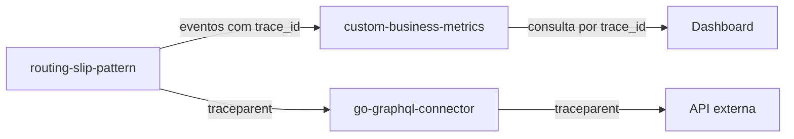

# Custom Business Metrics

O `custom-business-metrics` e a camada de observabilidade de negocio usada pelo ecossistema de workflows. Ele recebe eventos emitidos pelo `routing-slip-pattern`, armazena os dados em memoria ou DynamoDB e permite acompanhar o processamento em tempo real por dashboards e consultas HTTP.

## Objetivo

O objetivo do projeto e transformar cada etapa do processamento em uma evidencia consultavel:

- qual workflow executou;
- qual mensagem foi processada;
- qual etapa iniciou, concluiu, parou ou falhou;
- quanto tempo cada etapa levou;
- quais integracoes foram acionadas;
- qual `correlation_id` representa o processo de negocio;
- qual `trace_id` representa a trilha tecnica distribuida.

## Componentes

| Componente | Papel |
|---|---|
| `service` | API HTTP de ingestao, consulta, agregacao, retencao e dashboards. |
| `agent` | Recebe eventos UDP e encaminha em lote para o service. |
| `webview` | Interface web para acompanhar dashboards. |
| `DynamoDB` | Persistencia dos eventos para consulta historica. |

## Preparacao tecnica e feature flags

A Fase 0 adiciona campos de configuracao runtime para controlar capacidades evolutivas.

Exemplo retornado por `GET /v1/config`:

```json
{
  "retentionDays": 7,
  "features": {
    "tracingEnabled": true,
    "mcpEnabled": false,
    "asyncIngestEnabled": false,
    "traceIndexEnabled": true
  },
  "security": {
    "redaction": {
      "enabled": true,
      "fields": [
        "authorization",
        "client_secret",
        "access_token",
        "refresh_token",
        "password",
        "token",
        "api_key",
        "x-api-key"
      ]
    }
  }
}
```

| Campo | Padrão | Uso |
|---|---:|---|
| `features.tracingEnabled` | `true` | Indica suporte a eventos com `trace_id`. |
| `features.mcpEnabled` | `false` | Reserva para MCP Analytics Server. |
| `features.asyncIngestEnabled` | `false` | Reserva para ingestao assincrona. |
| `features.traceIndexEnabled` | `true` | Indica suporte ao indice `trace-index`. |

## Evento de metrica

Formato principal:

```json
{
  "name": "routing_slip.step.completed",
  "kind": "count",
  "value": 1,
  "unit": "event",
  "workflow": "order-processing",
  "step": "graphql_enrich",
  "status": "success",
  "source": "routing-slip-pattern",
  "trace_id": "4bf92f3577b34da6a3ce929d0e0e4736",
  "span_id": "00f067aa0ba902b7",
  "tags": {
    "message_id": "MSG-001",
    "correlation_id": "corr-001",
    "trace_id": "4bf92f3577b34da6a3ce929d0e0e4736",
    "span_id": "00f067aa0ba902b7",
    "handler": "graphql_enrich",
    "duration_ms": "142"
  },
  "timestamp": "2026-05-26T12:00:00Z"
}
```

`trace_id` e `span_id` podem ser enviados no topo do evento ou dentro de `tags`. Durante a validacao, o service normaliza os dois formatos para manter as consultas consistentes.

## Rastreabilidade distribuida

A Fase 1 da evolucao adiciona suporte explicito a `trace_id`.

Antes, o projeto ja conseguia buscar processos por tags como `correlation_id`. Agora tambem e possivel usar o `trace_id` para acompanhar a jornada tecnica de uma execucao distribuida entre:

- `routing-slip-pattern`;
- `go-graphql-connector`;
- APIs externas chamadas por connectors;
- eventos armazenados no metrics service.



## Endpoints principais

| Endpoint | Uso |
|---|---|
| `POST /v1/metrics` | Ingestao de eventos. |
| `GET /v1/metrics/events` | Lista eventos crus com filtros. |
| `GET /v1/metrics/trace/{trace_id}` | Lista eventos de um trace especifico. |
| `GET /v1/metrics` | Retorna sumarios agregados. |
| `GET /v1/metrics/series` | Retorna series temporais. |
| `GET /v1/dimensions` | Retorna dimensoes e tags conhecidas. |
| `GET /v1/dashboards` | Lista dashboards configurados. |
| `POST /v1/dashboards` | Cria ou atualiza dashboards. |

## Consultando por trace

Usando query string:

```bash
curl "http://localhost:8080/v1/metrics/events?trace_id=4bf92f3577b34da6a3ce929d0e0e4736"
```

Usando endpoint dedicado:

```bash
curl "http://localhost:8080/v1/metrics/trace/4bf92f3577b34da6a3ce929d0e0e4736"
```

Tambem e possivel combinar o trace com filtros de periodo, workflow ou status:

```bash
curl "http://localhost:8080/v1/metrics/trace/4bf92f3577b34da6a3ce929d0e0e4736?workflow=order-processing&status=failed"
```

## DynamoDB

Quando o storage DynamoDB esta habilitado, os eventos sao armazenados com:

- chave primaria por nome de metrica e timestamp;
- indice por `correlation_id`;
- indice por `trace_id`;
- TTL para retencao automatica.

Indices relevantes:

| Indice | Uso |
|---|---|
| `correlation-index` | Recuperar a jornada de um processo de negocio. |
| `trace-index` | Recuperar a trilha tecnica distribuida. |

## Beneficios

- Acompanhamento granular por etapa.
- Busca por processo de negocio usando `correlation_id`.
- Busca por trilha tecnica usando `trace_id`.
- Base para dashboards realtime.
- Evidencia para reprocessamento e auditoria.
- Preparacao para analytics MCP nas proximas fases.
