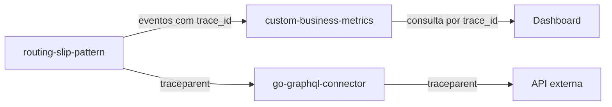

# Custom Business Metrics

O `custom-business-metrics` e a camada de observabilidade de negocio usada pelo ecossistema de workflows. Ele recebe eventos emitidos pelo `routing-slip-pattern`, armazena os dados em memoria ou DynamoDB e permite acompanhar o processamento em tempo real por dashboards e consultas HTTP.

## Objetivo

O objetivo do projeto e transformar cada etapa do processamento em uma evidencia consultavel:

- qual workflow executou;
- qual mensagem foi processada;
- qual etapa iniciou, concluiu, parou ou falhou;
- quanto tempo cada etapa levou;
- quais integracoes foram acionadas;
- qual `correlation_id` representa o processo de negocio;
- qual `trace_id` representa a trilha tecnica distribuida.

## Componentes

| Componente | Papel |
|---|---|
| `service` | API HTTP de ingestao, consulta, agregacao, retencao e dashboards. |
| `agent` | Recebe eventos UDP e encaminha em lote para o service. |
| `webview` | Interface web para acompanhar processamentos, periodo, filtros, etapas e detalhes. |
| `DynamoDB` | Persistencia dos eventos para consulta historica. |

## Execucao no workspace integrado

Na raiz de `/Users/raysouz/Workspace/estudos/workflows`, o projeto pode ser executado junto com o runtime de workflow e o GraphQL connector.

Modo com containers separados:

```bash
make prepare
```

Modo compacto:

```bash
make run-compact
```

No modo compacto, o `service` usa armazenamento em memoria e o `webview` e servido na porta `5173`. Esse modo reduz o custo local para demonstracoes e testes rapidos. Para validar persistencia historica, indices e TTL, use a stack padrao com DynamoDB.

URLs principais:

| Recurso | URL |
|---|---|
| Metrics API | `http://localhost:8080` |
| Metrics Webview | `http://localhost:5173` |

## Webview de processamento

O webview foi desenhado para acompanhamento operacional em tempo real:

- configuracao de URL e senha/token da API pelo botao de engrenagem;
- seletor de periodo com intervalos recentes ou periodo exato;
- grafico de barras com quantidade de processamentos por hora;
- area de metricas customizadas acima da lista de processamentos;
- modo de edicao do dashboard, habilitado por toggle, para adicionar, mover, redimensionar, editar e excluir widgets;
- lista de processamentos com data, workflow, `correlation_id`, `message_id`, duracao, etapas e resultado;
- filtro por atributo no formato `chave:valor`, por exemplo `correlation_id:abc`, `status:failed` ou `order_id:ORD-1001`;
- popup de processo com KPIs, tags e timeline de etapas;
- clique em uma etapa para abrir detalhes de entrada, regra aplicada, saida, status e motivo de falha.

Quando a senha/token e preenchida, o webview envia os headers `Authorization: Bearer <token>` e `X-API-Key: <token>`. O service aceita esses headers em CORS para permitir uso com APIs protegidas por gateway ou proxy.

### Dashboard customizavel

O painel de metricas do webview permite montar indicadores operacionais sem alterar o backend. Ao ativar o modo de edicao, uma paleta lateral fica disponivel com tipos de visualizacao:

| Tipo | Uso |
|---|---|
| `bar chart` | Comparar quantidades por status, workflow ou intervalos de tempo. |
| `pie chart` | Ver distribuicao proporcional de status ou agrupamentos. |
| `point plot` | Ver dispersao de duracao dos processos. |
| `query value` | Exibir um numero principal, como total de falhas ou reprocessamentos. |
| `table` | Listar processos que atendem uma consulta. |
| `timeseries` | Acompanhar evolucao temporal por rollup. |
| `top list` | Mostrar maiores ocorrencias por atributo, como workflow ou status. |

No modo de edicao:

- arraste um item da paleta para o grid;
- arraste um widget existente para reorganizar a ordem;
- use a borda inferior direita para redimensionar em unidades do grid;
- use o icone de lixeira para remover;
- use o icone de lapis para abrir a edicao da query;
- clique fora do popup ou no `x` para fechar sem salvar.

As configuracoes ficam no `localStorage` do navegador. Isso permite experimentar layouts durante testes locais sem depender de persistencia no service.

### Queries dos widgets

A sintaxe e inspirada em dashboards como Datadog:

```text
agregacao:metrica{filtros}.rollup(funcao, segundos)
```

Exemplos:

| Query | Resultado |
|---|---|
| `count:processes{*}` | Total de processos no periodo selecionado. |
| `count:processes{status:completed}` | Processos concluidos com sucesso. |
| `count:processes{status:failed}` | Processos com falha. |
| `count:reprocesses{*}` | Processos marcados como reprocessamento. |
| `avg:duration_ms{status:completed}` | Duracao media de processos concluidos. |
| `p95:duration_ms{*}` | Percentil 95 de duracao. |
| `top:workflow{status:failed}` | Ranking de workflows com falha. |
| `table:processes{status:failed}` | Tabela com processos com falha. |
| `count:processes{group_by:status}` | Serie agrupada por status. |
| `count:processes{*}.rollup(count, 60)` | Serie temporal com janelas de 60 segundos. |

Os filtros usam os campos do processo e tags emitidas pelo runtime, como `workflow`, `status`, `correlation_id`, `message_id`, `trace_id`, `handler`, `order_id` ou qualquer tag customizada.

## Case ecommerce-distributed

O case distribuido de ecommerce gera eventos suficientes para validar dashboards de acompanhamento operacional.

Dimensoes recomendadas:

| Dimensao | Uso |
|---|---|
| `workflow` | Separar o fluxo `ecommerce-order-fulfillment`. |
| `step` | Identificar gargalos por etapa. |
| `handler` | Comparar handlers de integracao, controle e auditoria. |
| `status` | Separar sucesso, falha, skip e reprocessamento. |
| `correlation_id` | Localizar um pedido especifico. |
| `trace_id` | Seguir a trilha tecnica entre runtime, GraphQL e APIs externas. |

Indicadores uteis:

- execucoes por minuto;
- tempo medio e p95 por step;
- falhas por integracao;
- quantidade de retries;
- reprocessamentos por periodo;
- etapas preservadas por idempotencia;
- tempo entre falha e retomada.

## Preparacao tecnica e feature flags

A configuracao runtime expoe campos para controlar capacidades operacionais sem exigir mudanca no contrato de ingestao de metricas.

Exemplo retornado por `GET /v1/config`:

```json
{
  "retentionDays": 7,
  "features": {
    "tracingEnabled": true,
    "mcpEnabled": false,
    "asyncIngestEnabled": false,
    "traceIndexEnabled": true
  },
  "security": {
    "redaction": {
      "enabled": true,
      "fields": [
        "authorization",
        "client_secret",
        "access_token",
        "refresh_token",
        "password",
        "token",
        "api_key",
        "x-api-key"
      ]
    }
  }
}
```

| Campo | Padrão | Uso |
|---|---:|---|
| `features.tracingEnabled` | `true` | Indica suporte a eventos com `trace_id`. |
| `features.mcpEnabled` | `false` | Reserva para MCP Analytics Server. |
| `features.asyncIngestEnabled` | `false` | Reserva para ingestao assincrona. |
| `features.traceIndexEnabled` | `true` | Indica suporte ao indice `trace-index`. |

## Evento de metrica

Formato principal:

```json
{
  "name": "routing_slip.step.completed",
  "kind": "count",
  "value": 1,
  "unit": "event",
  "workflow": "order-processing",
  "step": "graphql_enrich",
  "status": "success",
  "source": "routing-slip-pattern",
  "trace_id": "4bf92f3577b34da6a3ce929d0e0e4736",
  "span_id": "00f067aa0ba902b7",
  "tags": {
    "message_id": "MSG-001",
    "correlation_id": "corr-001",
    "trace_id": "4bf92f3577b34da6a3ce929d0e0e4736",
    "span_id": "00f067aa0ba902b7",
    "handler": "graphql_enrich",
    "duration_ms": "142"
  },
  "timestamp": "2026-05-26T12:00:00Z"
}
```

`trace_id` e `span_id` podem ser enviados no topo do evento ou dentro de `tags`. Durante a validacao, o service normaliza os dois formatos para manter as consultas consistentes.

## Rastreabilidade distribuida

O projeto suporta `trace_id` como identificador tecnico distribuido. Alem de buscar processos por tags como `correlation_id`, tambem e possivel usar o `trace_id` para acompanhar a jornada tecnica de uma execucao distribuida entre:

- `routing-slip-pattern`;
- `go-graphql-connector`;
- APIs externas chamadas por connectors;
- eventos armazenados no metrics service.



## Endpoints principais

| Endpoint | Uso |
|---|---|
| `POST /v1/metrics` | Ingestao de eventos. |
| `GET /v1/metrics/events` | Lista eventos crus com filtros. |
| `GET /v1/metrics/trace/{trace_id}` | Lista eventos de um trace especifico. |
| `GET /v1/metrics` | Retorna sumarios agregados. |
| `GET /v1/metrics/series` | Retorna series temporais. |
| `GET /v1/dimensions` | Retorna dimensoes e tags conhecidas. |
| `GET /v1/dashboards` | Lista dashboards configurados. |
| `POST /v1/dashboards` | Cria ou atualiza dashboards. |

## Consultando por trace

Usando query string:

```bash
curl "http://localhost:8080/v1/metrics/events?trace_id=4bf92f3577b34da6a3ce929d0e0e4736"
```

Usando endpoint dedicado:

```bash
curl "http://localhost:8080/v1/metrics/trace/4bf92f3577b34da6a3ce929d0e0e4736"
```

Tambem e possivel combinar o trace com filtros de periodo, workflow ou status:

```bash
curl "http://localhost:8080/v1/metrics/trace/4bf92f3577b34da6a3ce929d0e0e4736?workflow=order-processing&status=failed"
```

## DynamoDB

Quando o storage DynamoDB esta habilitado, os eventos sao armazenados com:

- chave primaria por nome de metrica e timestamp;
- indice por `correlation_id`;
- indice por `trace_id`;
- TTL para retencao automatica.

Indices relevantes:

| Indice | Uso |
|---|---|
| `correlation-index` | Recuperar a jornada de um processo de negocio. |
| `trace-index` | Recuperar a trilha tecnica distribuida. |

## Beneficios

- Acompanhamento granular por etapa.
- Busca por processo de negocio usando `correlation_id`.
- Busca por trilha tecnica usando `trace_id`.
- Base para dashboards realtime.
- Evidencia para reprocessamento e auditoria.
- Base para analytics MCP e investigacao operacional assistida.

## Resiliencia e metricas

O `routing-slip-pattern` e o `go-graphql-connector` registram tentativas e falhas de forma estruturada para que a operacao consiga diferenciar falhas transitorias, timeouts, circuit breaker aberto, abortos funcionais e reprocessamentos.

Eventos de etapa podem trazer tags como:

```json
{
  "tags": {
    "workflow": "order-processing",
    "handler": "graphql_enrich",
    "attempt": "3",
    "trace_id": "4bf92f3577b34da6a3ce929d0e0e4736",
    "span_id": "00f067aa0ba902b7",
    "failure_reason": "temporary network error"
  }
}
```

Esses dados permitem criar indicadores como:

- etapas com mais retries;
- tempo médio de recuperação após falha transitória;
- workflows que caem em fallback;
- volume de execuções com `status=skipped`, `status=jumped` ou `status=failed`;
- correlação entre falhas de integração e `trace_id`.

Essas informacoes formam a base para dashboards de resiliencia e tools MCP de analise operacional.

## State Store e Observabilidade de Reprocessamento

O state store persistente do `routing-slip-pattern` guarda snapshots de execucao. O `custom-business-metrics` continua responsavel pela visao operacional e pode consumir os eventos emitidos pelo runtime para mostrar onde um processamento parou, quando foi retomado e quais etapas foram ignoradas por idempotencia.

Eventos de etapa podem incluir status como:

| Status | Significado |
|---|---|
| `success` | Etapa concluida normalmente. |
| `failed` | Etapa falhou e o snapshot foi salvo com cursor no ponto correto. |
| `skipped` | Etapa pulada por politica de erro ou decisao de fluxo. |
| `jumped` | Etapa redirecionou o cursor para outro ponto. |
| `idempotent_skip` | Etapa ja havia sido concluida e nao foi repetida no reprocessamento. |

Com esses dados, dashboards podem evidenciar:

- quantidade de workflows em `failed`, `stopped` ou `completed`;
- tempo entre falha e reprocessamento;
- etapas com maior volume de retomadas;
- economia operacional gerada por `idempotent_skip`;
- correlacao entre `trace_id`, `correlation_id` e cursor salvo.

O state store guarda o snapshot; o metrics service transforma a execucao em leitura operacional para acompanhamento realtime e auditoria.

## MCP Analytics

O MCP Analytics funciona como uma camada de consulta operacional para agentes e Studio. A ideia e transformar metricas, traces e eventos persistidos em ferramentas de investigacao sem exigir acesso direto ao banco ou aos logs.

Tools previstas:

| Tool | Objetivo |
|---|---|
| `get_workflow_summary` | Volume, sucesso, falha e tempo medio por workflow. |
| `get_execution_by_correlation` | Busca a jornada de um processo por `correlation_id`. |
| `get_execution_by_trace` | Busca eventos tecnicos por `trace_id`. |
| `get_step_failure_rate` | Calcula falhas por etapa/handler. |
| `get_latency_percentiles` | Retorna p50, p90, p95 e p99. |
| `find_processes` | Busca por filtros no formato `key:value`. |
| `compare_reprocess` | Compara execucao original e reprocessamento. |

Essas tools usam os dados ja emitidos pelo `routing-slip-pattern`: `workflow`, `step`, `handler`, `status`, `attempt`, `trace_id`, `span_id`, `correlation_id` e os eventos de reprocessamento/idempotencia.

Beneficios esperados:

- investigacao guiada por agentes;
- explicacao operacional para usuarios de negocio e engenharia;
- reducao de consultas manuais em DynamoDB;
- insumos para dashboards inteligentes no Studio;
- comparacao objetiva entre falha, retomada e reprocessamento.

## Planner MCP e Sugestao de Metricas

O planner assistido por MCP do `routing-slip-pattern`, alem de sugerir steps, tambem gera uma primeira lista de metricas e pontos de auditoria para que o workflow nasca observavel.

Sugestoes padrao do planner incluem:

| Metrica | Objetivo |
|---|---|
| `workflow_started_total` | Volume de entradas por workflow. |
| `workflow_completed_total` | Total de conclusoes por status. |
| `workflow_failed_total` | Falhas por etapa e handler. |
| `workflow_step_duration_ms` | Duracao por etapa. |
| `workflow_reprocess_total` | Volume de reprocessamentos. |
| `workflow_idempotent_skip_total` | Etapas ignoradas por idempotencia. |

Essas sugestoes nao substituem desenho de dashboard. Elas funcionam como ponto de partida para garantir rastreabilidade, explicabilidade e comparacao entre execucao original e reprocessamento.

## Publicacao dos modulos Go

O repositorio possui dois modulos publicaveis:

| Componente | Caminho do modulo | Convencao da tag |
|---|---|---|
| Agent | `github.com/raywall/custom-business-metrics/agent` | `agent/vX.Y.Z` |
| Service | `github.com/raywall/custom-business-metrics/service` | `service/vX.Y.Z` |

Pull requests para `main` validam ambos os modulos com `go mod tidy`, testes e `go vet`. Depois do
merge, o workflow `Publish Go Modules` incrementa automaticamente a versao patch de cada modulo,
publica as tags e solicita as versoes ao Go Module Proxy para indexacao no `pkg.go.dev`.

Exemplo de consumo:

```bash
go get github.com/raywall/custom-business-metrics/agent@latest
go get github.com/raywall/custom-business-metrics/service@latest
```

As tags usam o prefixo do subdiretorio porque essa e a convencao exigida pelo ecossistema Go para
modulos que nao ficam na raiz do repositorio.

## Agent importavel

O agent pode ser executado como processo independente ou instanciado dentro de
uma aplicacao:

```go
agent, err := metrics.New(metrics.Config{
	ServiceEndpoint: "http://metrics-service:8080/v1/metrics",
	BatchSize:       100,
	BufferSize:      5000,
	FlushInterval:   time.Second,
})
go agent.Run(ctx)
defer agent.Close()
```

O metodo `Emit(ctx, event)` aceita eventos serializaveis. Isso permite que
`routing-slip-pattern`, `go-graphql-connector` e outras aplicacoes compartilhem
a mesma instancia sem acoplamento com o armazenamento. Falhas temporarias
mantem o lote no buffer para uma nova tentativa no proximo ciclo de flush.

## MCP Analytics

O metrics service disponibiliza um MCP Analytics read-only em `MCP_ADDR`
(`:9093` por padrao). Defina `MCP_SERVER_API_KEY` para proteger o endpoint.

| Tool | Uso |
|---|---|
| `find_processes` | Busca execucoes por filtros operacionais. |
| `get_execution_by_correlation` | Recupera a jornada por `correlation_id`. |
| `get_execution_by_trace` | Recupera eventos tecnicos por `trace_id`. |
| `get_workflow_summary` | Retorna metricas agregadas por workflow e periodo. |
