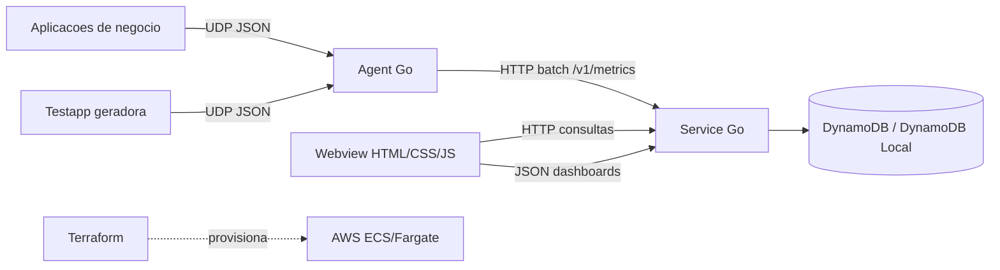

# Custom Business Metrics

Plataforma experimental para capturar, processar, consultar e visualizar metricas customizadas de negocio em tempo real.

O objetivo do projeto e oferecer uma base simples, modular e de baixo custo para observar processos complexos de negocio. Diferente de metricas tecnicas tradicionais, como CPU, memoria, latencia ou traces de infraestrutura, este projeto foca em perguntas operacionais como:

- quantos itens passaram por determinada etapa de uma jornada;
- qual volume financeiro, operacional ou quantitativo foi processado;
- quais resultados finais estao ocorrendo;
- quais itens estao sendo reprocessados;
- como uma jornada evolui por tags livres, como `etapa`, `result`, `correlation_id`, `trace_id`, `order_id` ou qualquer outra tag definida pela aplicacao.

## Visao Geral

O MVP possui quatro partes principais:

- `agent`: recebe metricas via UDP e encaminha lotes para o service.
- `service`: API Go responsavel por ingestao, armazenamento, agregacao, consulta, retencao e gestao de dashboards.
- `webview`: interface web para visualizar, criar e editar dashboards dinamicos.
- `testapp`: gerador sintetico de metricas para demonstrar a plataforma localmente.

Tambem existem artefatos de suporte:

- `docker-compose.yml`: executa o ambiente local completo.
- `Makefile`: comandos de execucao, build, testes e Terraform.
- `infra`: infraestrutura inicial em Terraform para AWS.

## Arquitetura Macro



## Como Funciona

1. Uma aplicacao publica uma metrica customizada em JSON para o agent via UDP.
2. O agent recebe eventos rapidamente, agrupa em pequenos lotes e envia para o service via HTTP.
3. O service valida, normaliza e armazena os eventos.
4. A webview consulta resumos, series temporais, dimensoes, tags e dashboards pela API.
5. Dashboards sao definidos em JSON e renderizados dinamicamente na webview.

No ambiente Docker, o armazenamento e feito com DynamoDB Local para simular o desenho previsto na AWS. O projeto ainda possui um adapter em memoria para testes e desenvolvimento rapido.

## Armazenamento e Retencao

O storage escolhido para o MVP na AWS e DynamoDB em modo on-demand com TTL por item.

Motivos:

- baixo custo operacional para workloads pequenos ou irregulares;
- cobranca por requisicao no modo on-demand;
- sem necessidade de provisionar capacidade inicialmente;
- TTL nativo para expirar metricas por configuracao de retencao;
- bom encaixe para consultas por chave, tags, `correlation_id` e historico operacional recente.

Timestream continua sendo uma alternativa forte para series temporais de alta escala, mas para este MVP ele foi evitado porque o magnetic store possui cobranca minima por conta/regiao, o que pode tornar o custo inicial menos interessante para testes pequenos. S3 pode ser uma excelente camada futura de historico frio, mas exigiria indexacao adicional ou Athena para consultas operacionais.

Como a retencao funciona:

1. A webview chama `PUT /v1/config` com `retentionDays`.
2. Novas metricas recebem `expires_at = now + retentionDays`.
3. No DynamoDB, `expires_at` e usado como atributo de TTL.
4. As consultas filtram itens expirados mesmo antes da remocao assíncrona do TTL.

No Docker, a mesma tabela e criada em DynamoDB Local pelo servico `dynamodb-init`.

## Exemplo de Uso: Jornada Logistica

Imagine uma operacao de e-commerce com milhares de pedidos passando por uma jornada de fulfillment:

- pedido recebido;
- autorizacao de pagamento;
- separacao no centro de distribuicao;
- embalagem;
- roteirizacao;
- coleta pela transportadora;
- tentativa de entrega;
- entrega concluida;
- devolucao ou reprocessamento.

Essa jornada pode envolver muitos servicos, filas, workers, integracoes com transportadoras, sistemas antifraude, roteirizadores, ERPs e ferramentas de atendimento. A visibilidade de negocio pode ser montada com metricas e tags como:

```json
{
  "name": "orders.processed",
  "kind": "count",
  "value": 1,
  "unit": "items",
  "segment": "marketplace",
  "workflow": "order-fulfillment",
  "step": "carrier-dispatch",
  "status": "success",
  "source": "shipping-worker",
  "tags": {
    "etapa": "coleta-transportadora",
    "processing_count": "1",
    "result": "coleta-realizada",
    "carrier": "fast-express",
    "warehouse": "sp-01",
    "region": "sudeste",
    "correlation_id": "corr-123",
    "trace_id": "trace-456",
    "order_id": "order-789"
  },
  "timestamp": "2026-05-05T12:00:00Z"
}
```

Com esse modelo, a ferramenta consegue responder:

- quantos pedidos estao em `tag.etapa=coleta-transportadora`;
- quantos pedidos finalizaram por `tag:result`;
- quais transportadoras concentram falhas usando `groupBy=tag:carrier`;
- quantos pedidos foram reprocessados usando `processing_count in(2,3,4,5)`;
- o que aconteceu com um pedido especifico filtrando por `tag.order_id`.

O ponto principal: as tags sao livres. A plataforma nao precisa conhecer previamente o dominio observado.

## Estrutura do Projeto

Os exemplos executaveis ficam em [`examples`](./examples):

- `importable-agent`: instrumentacao de uma aplicacao Go;
- `importable-service`: inicializacao da API HTTP como biblioteca;
- `webview`: stack completa com service, agent, gerador e interface.

```bash
make examples-test
make example-service
make example-agent
make example-webview
```

```text
.
├── agent
│   ├── cmd/agent
│   └── internal
│       ├── collector
│       └── forwarder
├── service
│   ├── cmd/service
│   └── internal
│       ├── adapters
│       │   ├── dynamodbstore
│       │   ├── httpapi
│       │   └── memory
│       ├── application
│       └── core
├── testapp
│   └── cmd/generator
├── webview
│   ├── index.html
│   ├── styles.css
│   └── app.js
├── infra
│   ├── config
│   ├── main.tf
│   ├── outputs.tf
│   ├── variables.tf
│   └── versions.tf
├── docker-compose.yml
├── Makefile
└── go.work
```

## Componentes

### Agent

O `agent` e um processo Go que:

- escuta pacotes UDP em `8125`;
- recebe eventos JSON;
- aplica timestamp quando necessario;
- encaminha lotes para `POST /v1/metrics`.

Ele permite que aplicacoes emitam metricas sem bloquear o fluxo principal da aplicacao.

### Service

O `service` e uma API Go com separacao em camadas:

- `core`: modelos de dominio, como `MetricEvent`, `MetricFilter`, `Dashboard` e `DashboardWidget`;
- `application`: casos de uso e portas de repositorio;
- `adapters/httpapi`: handlers HTTP;
- `adapters/dynamodbstore`: repositorio persistente usando DynamoDB ou DynamoDB Local;
- `adapters/memory`: repositorio em memoria usado em testes e desenvolvimento rapido.

Funcionalidades atuais:

- ingestao de metricas em lote;
- filtros por dimensoes fixas;
- filtros por tags livres;
- agrupamento por dimensao ou tag;
- series temporais por bucket;
- eventos brutos para auditoria por `correlation_id`;
- configuracao runtime de retencao;
- descoberta de dimensoes e tags conhecidas;
- CRUD parcial de dashboards.

### Webview

A `webview` e uma aplicacao estatica em HTML, CSS e JavaScript.

Ela permite:

- visualizar dashboards em tempo real;
- configurar tempo de retencao em dias;
- consultar eventos brutos por `correlation_id`;
- criar novos dashboards;
- editar dashboards em JSON;
- adicionar, duplicar, remover e mover widgets;
- alterar titulo, tipo, query e layout de widgets;
- renderizar indicadores, graficos temporais, barras, tabelas e listas.

### Testapp

A `testapp` gera metricas sinteticas para testar o MVP localmente. O gerador simula uma jornada de processamento com tags como:

- `etapa`;
- `processing_count`;
- `result`;
- `correlation_id`;
- `trace_id`;
- `parcela_id`;
- `channel`;
- `product`.

Ela tambem simula uma execucao distribuida: varios eventos emitidos por diferentes `service` e `env` podem compartilhar o mesmo `correlation_id`, representando uma jornada e2e que atravessa multiplos servicos.

Esses nomes sao apenas dados de exemplo. Em uma aplicacao real, qualquer conjunto de tags pode ser usado.

## Executando Localmente

### Com Docker

```sh
make run
```

Servicos expostos:

- Webview: `http://localhost:5173`
- Service: `http://localhost:8080`
- Healthcheck: `http://localhost:8080/health`
- Agent UDP: `localhost:8125`
- DynamoDB Local: `http://localhost:8000`

Para parar:

```sh
make stop
```

Para acompanhar logs:

```sh
make logs
```

### Sem Docker

Execute em terminais separados:

```sh
make service
make agent
make generator
make webview
```

## Contrato de Metrica

Aplicacoes enviam um JSON via UDP para o agent.

```json
{
  "name": "orders.processed",
  "kind": "count",
  "value": 1,
  "unit": "items",
  "segment": "marketplace",
  "workflow": "order-fulfillment",
  "step": "carrier-dispatch",
  "status": "success",
  "source": "shipping-worker",
  "tags": {
    "etapa": "coleta-transportadora",
    "processing_count": "1",
    "result": "coleta-realizada",
    "carrier": "fast-express",
    "order_id": "order-789"
  },
  "timestamp": "2026-05-05T12:00:00Z"
}
```

Campos:

- `name`: nome da metrica.
- `kind`: `count`, `gauge` ou `money`.
- `value`: valor numerico.
- `unit`: unidade opcional, como `items`, `BRL`, `seconds`.
- `segment`: agrupamento macro de negocio.
- `workflow`: jornada ou processo observado.
- `step`: etapa tecnica ou funcional.
- `status`: status geral, como `success` ou `error`.
- `source`: sistema ou servico emissor.
- `tags`: mapa livre de dimensoes especificas do dominio.
- `timestamp`: horario do evento. Se omitido, o service usa o horario de recebimento.

## API do Service

### Healthcheck

```http
GET /health
```

### Configuracao Runtime

```http
GET /v1/config
PUT /v1/config
```

Body:

```json
{
  "retentionDays": 14
}
```

Essa configuracao define a retencao aplicada as novas metricas ingeridas.

### Ingestao

```http
POST /v1/metrics
```

Body:

```json
{
  "events": [
    {
      "name": "orders.processed",
      "kind": "count",
      "value": 1,
      "tags": {
        "etapa": "coleta-transportadora"
      }
    }
  ]
}
```

### Resumos Agregados

```http
GET /v1/metrics
```

Exemplos:

```sh
curl "http://localhost:8080/v1/metrics"
curl "http://localhost:8080/v1/metrics?name=orders.processed"
curl "http://localhost:8080/v1/metrics?tag.etapa=coleta-transportadora"
curl "http://localhost:8080/v1/metrics?name=orders.processed&groupBy=tag:result"
curl "http://localhost:8080/v1/metrics?name=orders.processed&tagIn.processing_count=2,3,4,5"
```

### Eventos Brutos

```http
GET /v1/metrics/events
```

Este endpoint existe para auditoria, validacao historica e reconstrucao de uma jornada e2e.

Exemplos:

```sh
curl "http://localhost:8080/v1/metrics/events?limit=20"
curl "http://localhost:8080/v1/metrics/events?tag.correlation_id=corr-123&limit=500"
curl "http://localhost:8080/v1/metrics/events?tag.service=shipping-worker&tag.env=prod"
```

### Series Temporais

```http
GET /v1/metrics/series
```

Exemplo:

```sh
curl "http://localhost:8080/v1/metrics/series?name=orders.processed&bucket=1m"
```

### Dimensoes e Tags Conhecidas

```http
GET /v1/dimensions
```

Retorna valores conhecidos para:

- `segments`;
- `workflows`;
- `steps`;
- `statuses`;
- `sources`;
- `tagKeys`;
- `tags`.

### Dashboards

```http
GET /v1/dashboards
POST /v1/dashboards
DELETE /v1/dashboards/{id}
```

## Correlation ID e Jornadas Distribuidas

Uma jornada e2e pode atravessar muitos componentes: containers em ECS, Step Functions, Lambdas, filas, workers e integracoes externas. Para entender que todos os eventos fazem parte do mesmo processamento, cada servico deve propagar uma tag comum:

```json
{
  "tags": {
    "correlation_id": "corr-123",
    "trace_id": "trace-456",
    "service": "shipping-worker",
    "env": "prod",
    "order_id": "order-789"
  }
}
```

Com isso, a plataforma permite:

- consultar todos os eventos de uma execucao com `tag.correlation_id`;
- agrupar metricas por `tag:service`;
- separar ambientes por `tag.env`;
- validar a ordem temporal dos eventos pelo endpoint `/v1/metrics/events`;
- montar dashboards por servico, ambiente, resultado, etapa ou qualquer tag criada pela aplicacao.

## Filtros e Agrupamentos

Dimensoes fixas:

- `segment`;
- `workflow`;
- `step`;
- `status`;
- `source`.

Tags livres:

```text
tag.<nome>=<valor>
```

Exemplo:

```sh
curl "http://localhost:8080/v1/metrics?tag.carrier=fast-express"
```

Filtro de lista:

```text
tagIn.<nome>=valor1,valor2,valor3
```

Exemplo:

```sh
curl "http://localhost:8080/v1/metrics?tagIn.processing_count=2,3,4,5"
```

Agrupamento:

```text
groupBy=segment
groupBy=status
groupBy=tag:result
groupBy=tag:carrier
```

## Dashboards JSON

Dashboards sao armazenados como JSON para facilitar:

- versionamento;
- compartilhamento;
- parametrizacao;
- construcao dinamica;
- renderizacao declarativa na webview.

Exemplo:

```json
{
  "schemaVersion": 1,
  "name": "Fulfillment operations",
  "description": "Acompanhamento e2e da jornada logistica.",
  "refreshSeconds": 5,
  "variables": [],
  "widgets": [
    {
      "id": "processed",
      "type": "indicator",
      "title": "Pedidos processados",
      "query": "sum:orders.processed{}.as_count()",
      "layout": { "x": 0, "y": 0, "w": 3, "h": 2 },
      "display": { "label": "total" }
    },
    {
      "id": "by-result",
      "type": "bar",
      "title": "Resultado por tag",
      "query": "sum:orders.processed{} by {tag:result}.as_count()",
      "layout": { "x": 3, "y": 0, "w": 6, "h": 3 },
      "display": { "legend": true }
    },
    {
      "id": "reprocess",
      "type": "table",
      "title": "Reprocessamentos",
      "query": "sum:orders.processed{processing_count in(2,3,4,5)} by {tag:processing_count}.as_count()",
      "layout": { "x": 0, "y": 3, "w": 6, "h": 3 }
    }
  ]
}
```

### Widgets

Tipos suportados no MVP:

- `indicator`: indicador numerico.
- `timeseries`: grafico temporal.
- `bar`: grafico de barras por grupo.
- `table`: tabela agregada.
- `list`: lista simples de grupos e valores.

Layout:

- `x`: coluna inicial no grid.
- `y`: linha inicial no grid.
- `w`: largura em colunas.
- `h`: altura em linhas.

O grid da webview usa 12 colunas em desktop.

## Query DSL

O MVP possui um dialeto inicial inspirado em ferramentas como Datadog:

```text
sum:nome-da-metrica{filtros}.as_count()
sum:nome-da-metrica{filtros} by {agrupamento}.as_count()
```

Exemplos:

```text
sum:orders.processed{}.as_count()
sum:orders.processed{etapa:coleta-transportadora}.as_count()
sum:orders.processed{carrier:fast-express and region:sudeste}.as_count()
sum:orders.processed{processing_count in(2,3,4,5)} by {tag:processing_count}.as_count()
sum:orders.processed{result:falha-transportadora} by {tag:carrier}.as_count()
```

Regras atuais:

- filtros com nomes `segment`, `workflow`, `step`, `status` e `source` sao tratados como dimensoes fixas;
- todos os outros filtros sao tratados como tags;
- `and` e `or` sao aceitos no parser inicial, mas o MVP aplica os filtros como interseccao;
- `in(...)` filtra uma tag por uma lista de valores;
- `by {tag:nome}` agrupa por tag;
- `by {status}`, `by {segment}` e similares agrupam por dimensoes fixas;
- `.as_count()` e mantido no contrato para evolucao da DSL.

## Comandos Uteis

```sh
make help
make run
make stop
make logs
make fmt
make test
make build
```

## Terraform

O diretorio `infra` contem uma infraestrutura inicial para AWS.

```sh
make terraform-init
make terraform-plan
```

O arquivo `infra/config/dev.tfvars` centraliza variaveis do ambiente. O valor de `service_image` deve ser trocado pela imagem publicada do service quando houver pipeline de build e publicacao.

Recursos previstos no MVP:

- VPC;
- subnets publicas;
- internet gateway;
- security group;
- ECS cluster;
- ECS service em Fargate;
- CloudWatch Log Group.

## Limitacoes do MVP

- Armazenamento em memoria.
- Dashboards em memoria.
- Sem autenticacao.
- Sem controle de workspace ou organizacao.
- DSL ainda simples.
- Sem motor de agregacao distribuido.
- Sem persistencia historica real.

## Evolucoes Naturais

- Persistir metricas em Timestream, DynamoDB, PostgreSQL ou ClickHouse.
- Persistir dashboards em banco.
- Criar workspaces e permissoes.
- Evoluir a DSL com `avg`, `min`, `max`, percentis e funcoes de rollup.
- Adicionar stream por WebSocket ou Server-Sent Events.
- Criar SDKs leves para varias linguagens.
- Adicionar templates de dashboards.
- Implementar import/export de dashboards JSON.
- Provisionar imagens e deploy AWS via pipeline.
# custom-business-metrics
# obsidian-flash-cards
