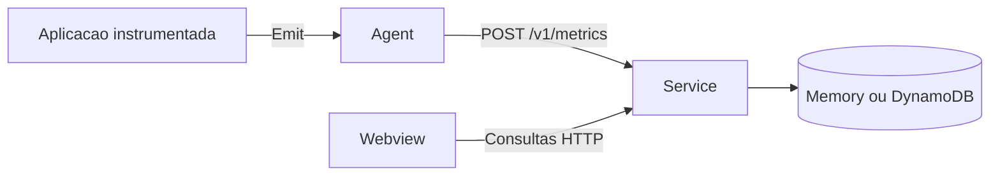

# Exemplos do Custom Business Metrics

Este diretorio demonstra como provisionar e consumir as tres pecas da solucao.

| Exemplo | O que demonstra |
|---|---|
| [`importable-agent`](./importable-agent) | Instrumenta uma aplicacao Go com o agent importavel e envia eventos em lotes para o service. |
| [`importable-service`](./importable-service) | Instancia o service HTTP com storage em memoria. |
| [`webview`](./webview) | Provisiona service, agent, gerador de eventos e webview com Docker Compose. |

## Fluxo



Para usar as bibliotecas publicadas:

```bash
go get github.com/raywall/custom-business-metrics/agent@latest
go get github.com/raywall/custom-business-metrics/service@latest
```

Os `replace` presentes nos exemplos apontam para o codigo local do repositorio e permitem validar
mudancas antes de uma nova versao ser publicada. Remova-os em uma aplicacao externa.

Atalhos a partir da raiz do projeto:

```bash
make examples-test
make example-service
make example-agent
make example-webview
```
